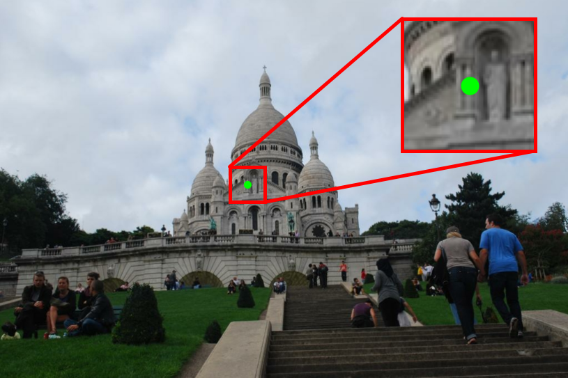
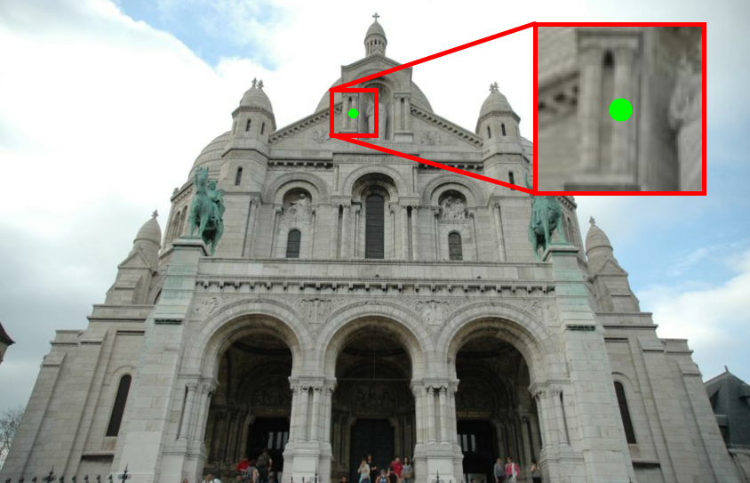

# Fast Relative Pose Estimation using Relative Depth


<p align="middle">
  <h3 align="center">Presented at 3DV 2024</h3>
  <h3 align="center">
  <a href="https://vlarsson.github.io/assets/pdf/astermark2024fast_poster.pdf">Poster</a>
  |
  <a href="https://vlarsson.github.io/assets/pdf/astermark2024fast.pdf">Paper</a>
  </h3>
</p>


This repository hosts the official implementation of the paper *Fast Relative Pose Estimation using Relative Depth*. It includes a 3-point minimal solver for relative pose implemented in [PoseLib](https://github.com/PoseLib/PoseLib/tree/874f3d47fe7a47e3fe08edb2d615220b044405e5), a neural network (*RelScaleNet*) for estimating relative scales, and code to demonstrate their usage. We also include code for running evaluation on pre-computed SuperPoint+SuperGlue keypoints on ScanNet.


<p align="center">
  <a href="https://scholar.google.com/citations?user=dsEPAvUAAAAJ&hl=sv&oi=ao">Jonathan Astermark</a>
  ·
  <a href="https://scholar.google.com/citations?user=DkrdHFgAAAAJ&hl=sv&oi=ao">Yaqing Ding</a>
  ·
  <a href="https://vlarsson.github.io/">Viktor Larsson</a>
  ·
  <a href="https://scholar.google.com/citations?user=9j-6i_oAAAAJ&hl=sv&oi=ao">Anders Heyden</a>
</p>


<p float="middle" align="middle">
  
  
</p>


## Setup

### Create Conda environment
```
conda env create --file environment.yml
conda activate reldepth
```

### Get pre-trained weights for RelScaleNet
```sh
wget -N -P weights https://vision.maths.lth.se/jastermark/relscalenet/weights/model_final.pth
```

### Install solver
The 3-point solver is implemented in [PoseLib](https://github.com/PoseLib). To install it, run
```sh
git submodule update --init --recursive
cd PoseLib
pip install .
cd ..
```

## Demos


### Demo on single image pair
A simple demo on a single image pair is implemented in `demo.ipynb`.


### Evaluation on ScanNet-1500
We provide code to evaluate *RelScaleNet* and our 3-point solver on ScanNet-1500 by following the steps below. Note that the results will differ slightly from the paper, as a different RANSAC-implementation was used.

1. Download the ScanNet-1500 images and pre-extracted SuperPoint+SuperGlue keypoints.
```sh
cd data
bash download_scannet.sh
cd ..
```

In the paper we used SuperPoint+SuperGlue keypoints extracted at 640x480 pixels, which led to matches with a lower inlier ratio. If you would like to use the same keypoints we used in the paper, they are available here:
```
wget -N http://vision.maths.lth.se/viktor/posebench/relative/scannet1500_spsg_old.h5
```

2. (Optional) Pre-compute RelScaleNet estimations on the SP+SG keypoints. The results are stored in a *.h5-file.
```sh
python precompute_relscalenet.py
```

3. Run the notebook `evaluate_relscalenet.ipynb` to evaluate *RelScaleNet* on SP+SG keypoints on ScanNet.

4. Run the notebook `evaluate_solver.ipynb` to evaluate our 3-point solver on SP+SG keypoints on ScanNet.


## BibTeX Citation
If you find our method useful, please consider citing our paper.
```
@inproceedings{astermark2024fast,
  author    = {Astermark, Jonathan and 
               Ding, Yaqing and
               Larsson, Viktor and
               Heyden, Anders},
  title     = {Fast Relative Pose Estimation using Relative Depth},
  booktitle = {3DV},
  year      = {2024}
}
```
